# Lab3 

## Tutorials 

The majority of the work is dedicated to Part 1 (Challenges 1-3), which focuses on learning how to use Python to communicate with the MCU. Part 2 is a short guided tutorial on using the Bluetooth module of the FireBeetle, but you’ll likely want to do this in the Lab hour since it can be tricky.

### Python Tutorial

> Q1. Show the code - Starting with a = “Hello World!!!”, come up with a code that will give us b = “Hello” and c = “World” and d = “!!!” . Also, in code, check if “ello” is in a.

> A1. The codes are output is shown in the following picture. 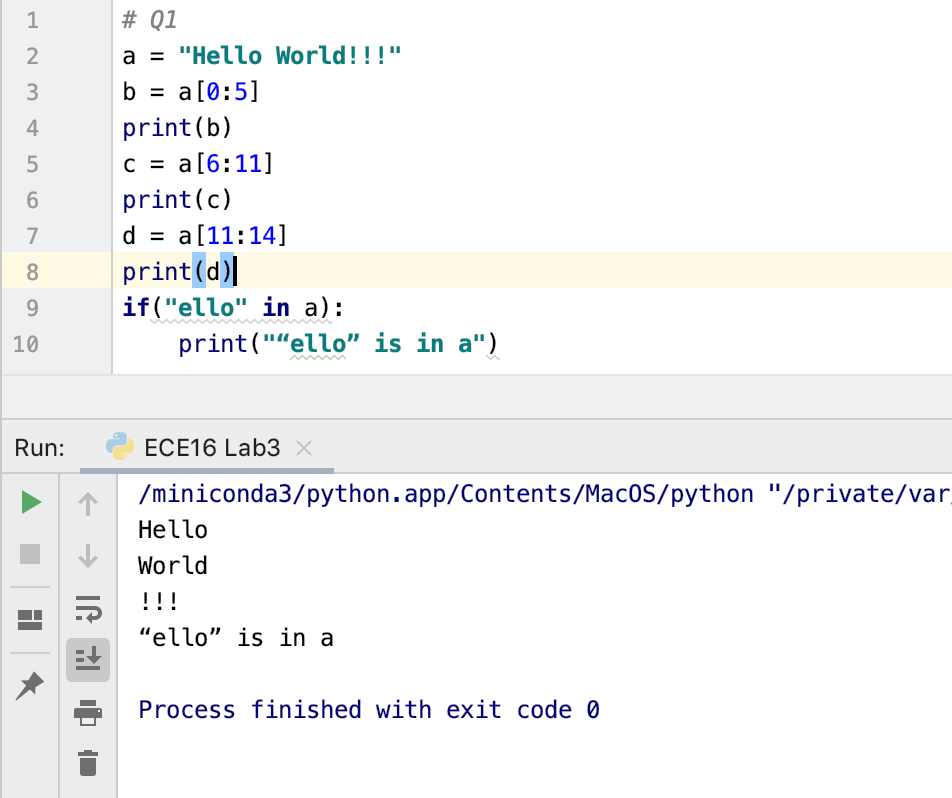

> Q2. In the following code, what is the output of the print statement? Why doesn’t original_list = ['hi','how','are','you']?

> The output is shown in the following picture. The reason why original_list is not ['hi','how','are','you'] is that, the elements of orginal_list would not change when its copy changes in plain Python. 

> 

### Connecting Arduino and Python

A program that can communicate with our MCU through Serial. 

>  Q1. Try sending without the .encode 

> A1 

> Q2. Identify in the above code, (1) which python command prints to the python’s own console, and (2) which python command prints to the serial port to the MCU?

> A2. line **print(ser.name)** prints to python's own console, while line **ser.write(S.encode('utf-8'))** writes to the serial port to the MCU, as shown in the following picture.
>
>  

> Q3. What happens if you take out the \n in the string? Why?

> There would be nothing shown on the OLED screen, cuz it detects if there is a \n in the ReceiveMessage function, and it would only print when it detects \n. 

###  Receiving Data with Python 

Have the MCU send data to Python. 

Here, I'm using the Arduino codes from Lab1. 

> Q. Describe the output you observe on the Python side? 

> A. It's a period of the output of the timer of length 8. 

> Q. Change the code to read 10 bytes instead of 30. Now what do you get? What are the 10 bytes you received? Remove decode might help you understand

> 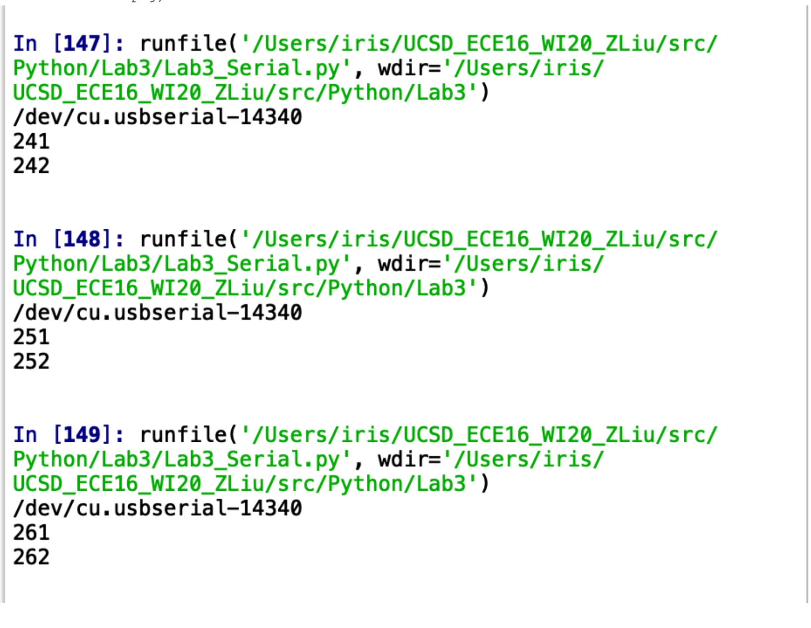
>
> It would print two time values every time. 

### Receiving a byte at a time 

> Q. Describe the output you observe on the Python side? Is it the same as before? What does this tell you about the print() function of python? 

> **Output of using  readSerial2(ser) **

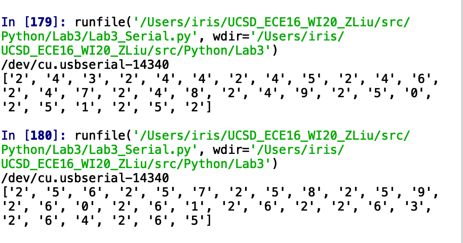

> Print in read_serial2 was printing each number it receives, while Print in read_serial3 was printing each single byte of number it receives and organize them as a string. 

### Knowing when to quit 

> Q. We purposely made a few errors above. What were they? 

> A. I should use the lowercase 'try:'. 

### **Numpy**

> Q. Show the code - Make an Numpy Array called test_array  from a list = [0,10,4,12]. Subtract 20 from the test_array, what do you get? What is the shape of the test_array

> A. I got the element-wise subtraction result.Shape is 4 * 1. 
>
> 

> Q. Show the code - Make a 2D array of test_2D_array from [0,10,4,12] [1,20,3,41]

> A. 

> Q. Make a 2D array of zeros with shape of 10x20 and then print it out

> A. As shown in the codes & output. 
>
> 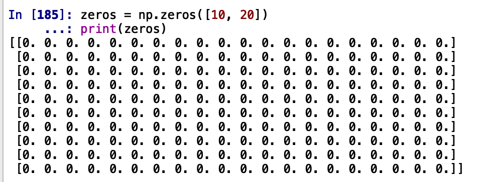

>  Q. Show the code - Out of the test_array, create the following using hstack and vstack. 

> A. 

> Q. arrange
>
> Show the code - Using arange, make an array called arange_array1 to equal [-3, 3,9,15] 
>
> and arange_array2 to equal [ -7,  -9, -11, -13, -15, -17, -19]

> A.

> Q. linspace
>
> Make an array call linspace_array using linspace that goes from 0 to 100 with 49 steps. 

> A. 
>
> 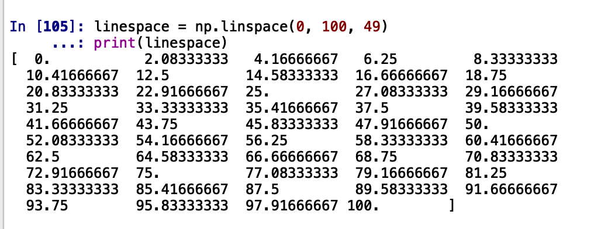

> Q. How does linspace and arange differ? When might you use one over the other?

> A. linespace specifys the interval numbers and do the division itself automatically, while arange specifies the interval length. When I want a specific interval, I would do "arange". When I'm sure about how many intervals I want, I would do "linespace".

> Q. Show your code - Now solve the above indexing and slicing problem by writing the code using array assignment. 

> A. My codes and the output is shown in the picture. 
>
> 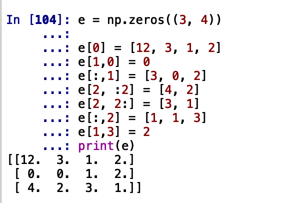

> Q. Using fromstring, vstack, and a for loop, create an array of 100x4 from s: [[1,2,3,4],[1,2,3,4],[1,2,3,4]…..[1,2,3,4]]. 

> A. Shown in the following picture. (The whole array was not shown as it was too big.)
>
> 

## Challenges 

### Challenge 1 

Setting the watch to send time&accelerometer reading to Serial monitor, and control it in the serial monitor. 

The reading and operation in the Serial Monitior is shown in the gif.

### Challenge 2 

Setting the watch to send time&accelerometer reading to Python IDE(Spyder), and control it in the Python side. 

A screen shot of what I received in Python: 

> 

> Q. What happens if you don’t decode the incoming char?

> A. The output is shown the picture: I wouldn't get anything at all. 
>
> 

> Q. Try removing the logic for checking if the data_array is empty and always vstack even if the data_array is empty. What is the error that gets thrown? Why?

> A. As shown in the picture, there would be Value Error, as whem data array is empty and is put into the final data_array we get, it's size is not the same as a normal (unempty) new data_array, so we cannot stack it that way. 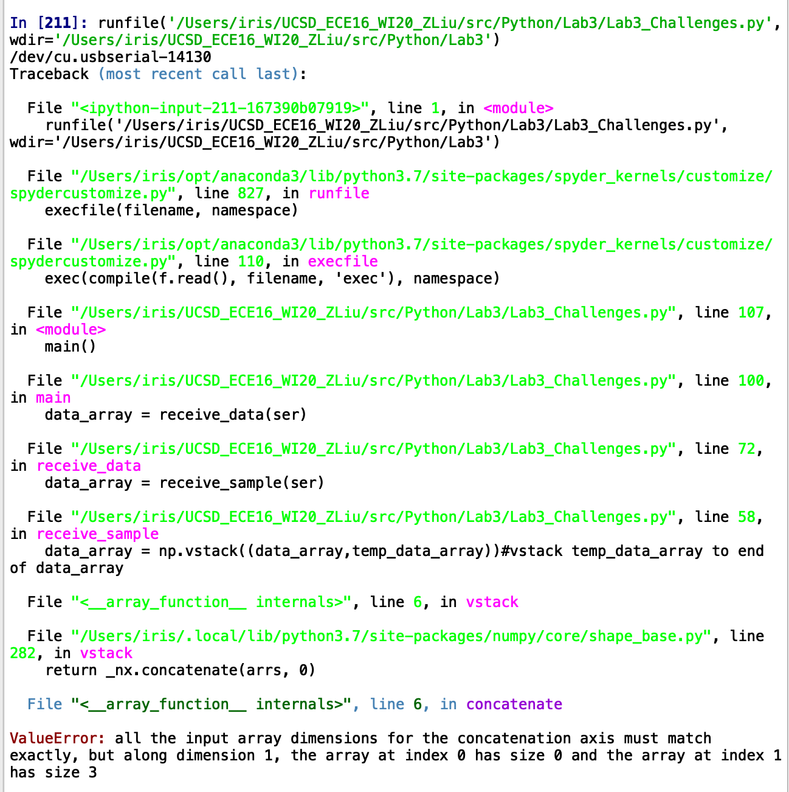

> Q. Try removing the 1 second delay on the MCU when starting data sending. Describe what happens?

> A. There would be weird&unreasonable readings of the time(). 
>
> 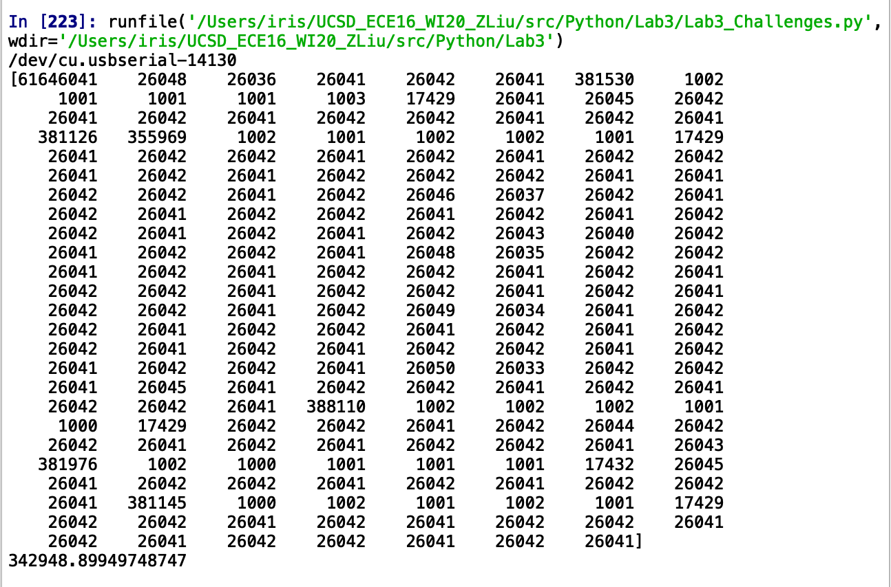
>
> 

### Challenge 3 

Calculating the Sampling rate. 

What I receive on the Python side is shown as following

> Q. Start with Baud rate of 115200. What is your calculated sampling rate when you set the sampling rate to 10Hz,50Hz,100Hz,1000Hz on the MCU. Make a plot (using a spreadsheet program) of the actual sampling rate (y-axis) vs expected sampling rate (x-axis).

> A. The actualy sampling rates of different sampling rates settings are shown in the following screenshots. (all us of 115200 Baud Rate)
>
> 10Hz 
>
> 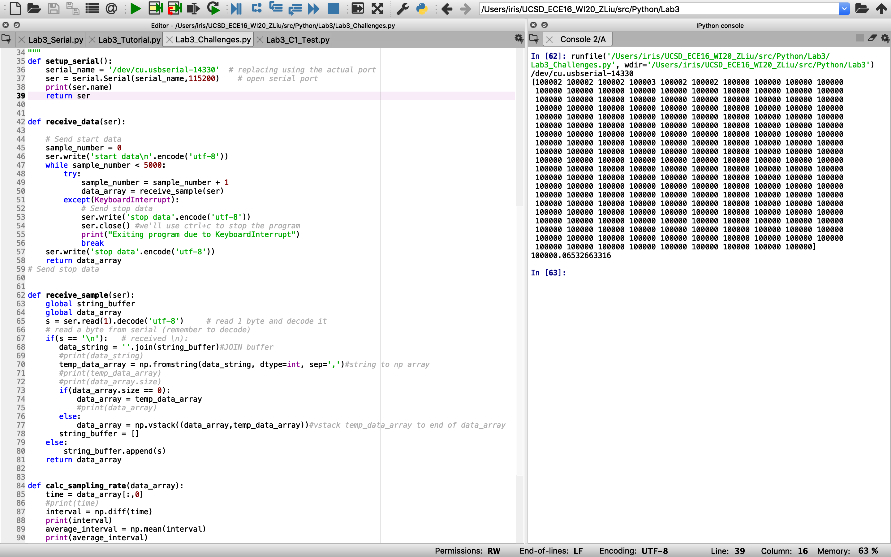
>
> 50Hz
>
> 
>
> 100Hz 
>
> 
>
> 1000Hz 
>
> 
>
> The graph: 
>
> 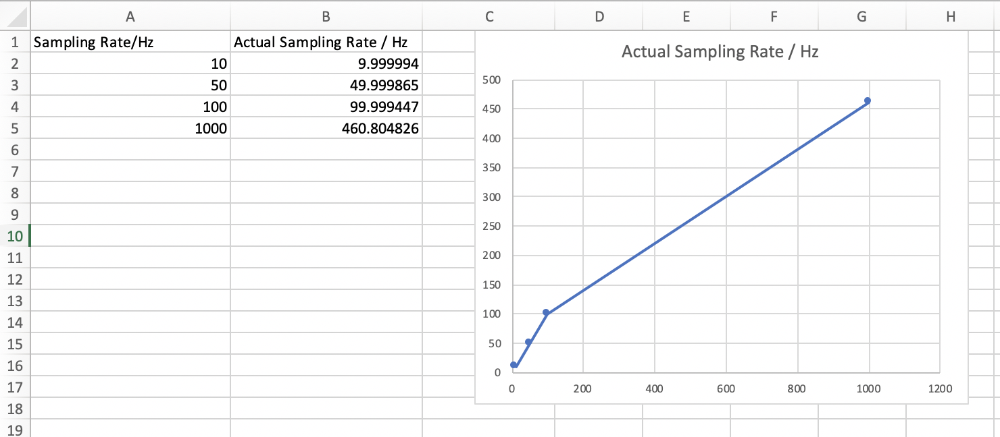

> Q. How does this change with Baud rate 9600 vs 115200 vs 230400 vs 460800. For 1000Hz, make a plot of the actual sampling rate (y-axis) vs Baud Rate (x-axis).

> A. The actualy sampling rates of different baud rate settings are shown in the following screenshots. 
>
> (the sampling rate of all is 1000Hz)
>
> 9600
>
> 
>
> 115200
>
> 
>
> 230400
>
> 
>
> 460800
>
> 
>
> The graph: 
>
> 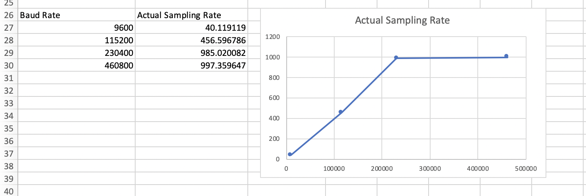

> Q. What happens if you use millis instead of micros for timing and Why?
>
> It looks more accurate. We switched to a higher unit, and the error looks smaller, resulting in a result which looks more accurate. 
>
> Sampling Rate 10:  Sampling rate: 1000/100.0 = 10.0
>
> 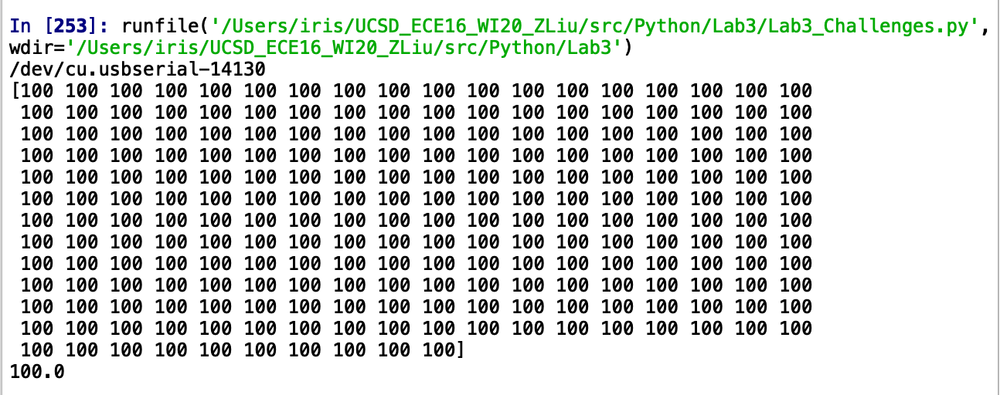
>
> Sampling Rate 100:  Sampling rate: 1000/10.0 = 100.0
>
> 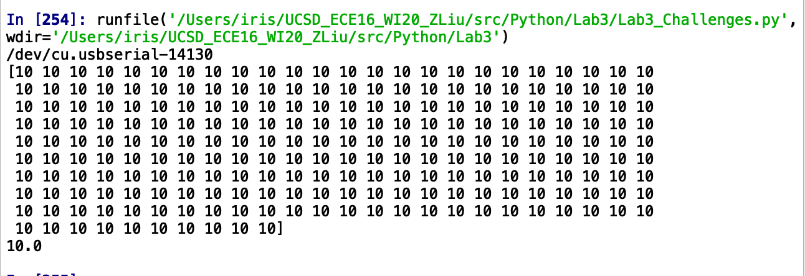
>
> Sampling Rate 50:  Sampling rate: 1000/50.0 = 20.0
>
> 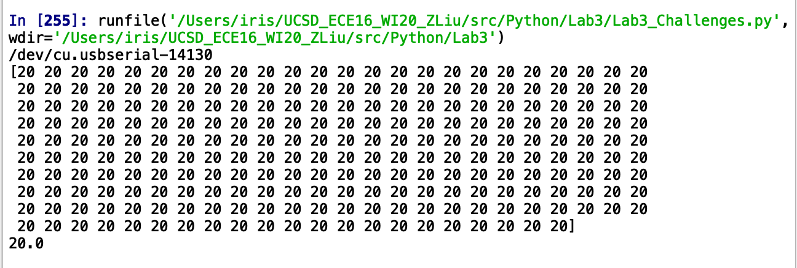

### Challenge 4 

bluetooth 

Here, I'm still using the codes in Challenge3 and receiving the time data in part3; sampling_rate = 50, baud rate = 9600. 

The Video: (As I can only get the active data from serial monitor, I made my git using it. )

The calculation of Baud Rate: 36.9Hz, as 1000000/the actual baud rate shown in the following picture. 

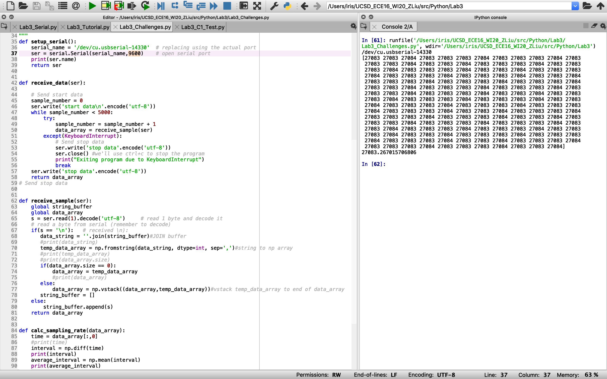

